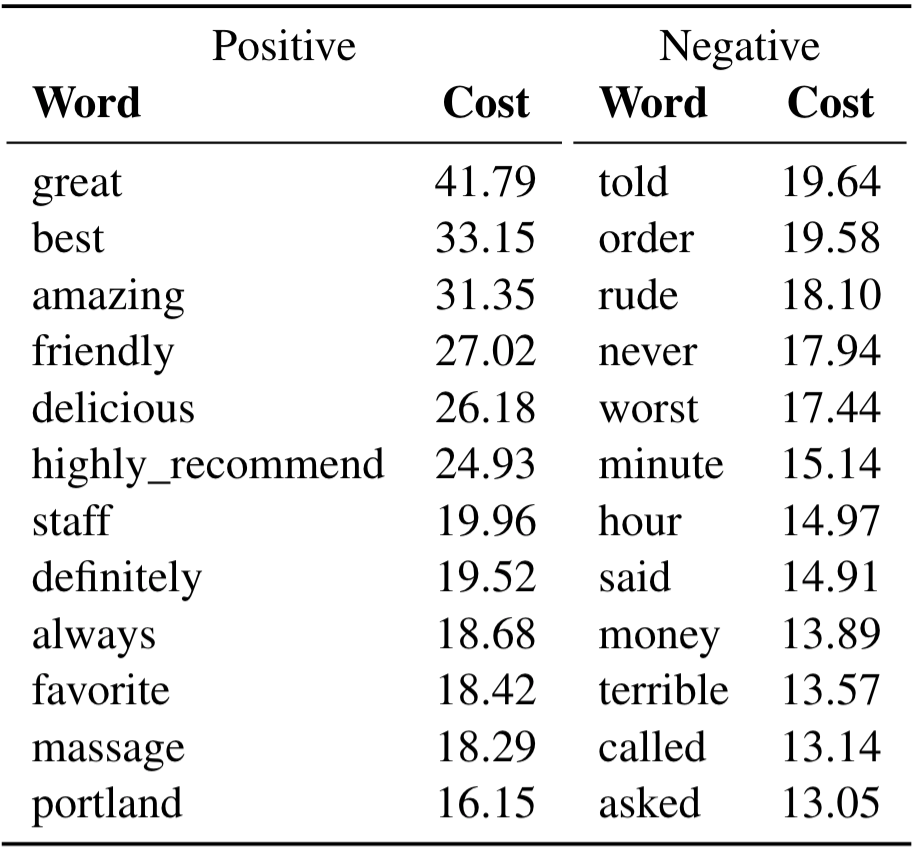

# wmdecompose

wmdecompose is a Python package for leveraging the inherent interpretability of Word Mover's Distance (WMD), which to date has not been enabled in any of the existing implementations of the framework. 

The main idea with wmdecompose, is that the WMD between a pair of documents or two sets of documents can be decomposed into word-level distances. This way, we gain an understanding of not just the overall semantic distance between two sets of documents, but also of the distance that individual words contribute to the total WMD. Furthermore, the package allows users to cluster words, so that word-level distances can be understood through coherent and interpretable wholes.

The package was originally published as part of the paper ["WMDecompose: A Framework for Leveraging the InterpretableProperties of Word Mover’s Distance in Sociocultural Analysis"](https://github.com/maybemkl/wmdecompose/tree/master/paper) as part of the [SIGHUM workshop](https://sighum.wordpress.com/events/latech-clfl-2021/) of the [2021 EMNLP conference](https://2021.emnlp.org/). Notebooks and scripts for replicating the paper can be found in the [paper](https://github.com/maybemkl/wmdecompose/tree/master/paper) subfolder of this repo.

## Installation

To install wmdecompose, pull this repository from github:

```bash

git clone https://github.com/maybemkl/wmdecompose.git

```

Then, make sure you are in the root folder of the local copy of the repository and run the following command, preferably inside a virtual environment:


```bash

pip install .

```

## Examples

Using the well-known review dataset from Yelp, filtered to reviews written after 2017 in Atlanta or Portland and with one or five stars, wmdecompose gives the following words as top contributors to the overall WMD when moving from positive to negative reviews (left column) and vice versa (right column):


Clustering the word-level distances using t-SNE and K-means, we get the following cluster-level distances, with cluster keywords organized by intra-cluster word-level distances for positive to negative (top) and negative to positive (bottom):


For more examples, see the wmdecompose paper.

## Usage

For detailed code examples on how to use the package, see the [notebooks](https://github.com/maybemkl/wmdecompose/tree/master/paper/notebooks) for the wmdecompose paper.

## Citation

When using the wmdecompose package, please cite the original paper:

```bibtex

@inproceedings{Brunila2021WMDecompose,
    title = {WMDecompose: A Framework for Leveraging the Interpretable Properties of Word Mover’s Distance in Sociocultural Analysis},
    booktitle = {Proceedings of the {Fifth} {Workshop} on {Computational} {Linguistics} for {Cultural Heritage}, {Social Sciences}, {Humanities} and {Literature}},
    publisher = {Association for Computational Linguistics},
    author = {Brunila, Mikael and LaViolette, Jack},
    month = nov,
    year = {2021}
}

```
